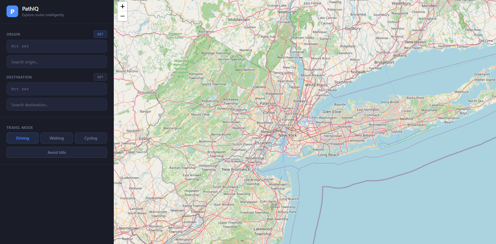

# PathIQ

PathIQ is a route planning application built with React and Leaflet.  
It allows users to select two points on a map and visualize routes with real-time distance and estimated travel time.

The goal of the project is to provide a simple, interactive way to understand routes in terms of distance, duration, and transport mode.

---



---

- _site URL_:  `path-iq-eight.vercel.app`


## Features

- Interactive map using Leaflet
- Select origin and destination by clicking on the map
- Route calculation using OpenStreetMap routing API (OSRM)
- Displays:
  - Distance (meters / kilometers)
  - Estimated travel time
- Support for multiple transport modes:
  - Driving
  - Walking
  - Cycling
- Dynamic route updates when changing mode or points
- Clean sidebar UI for route information

---

## Tech Stack

- React
- Vite
- Leaflet / React-Leaflet
- OpenStreetMap tiles
- OSRM Routing API

---

## How it works

1. User selects a point as origin
2. User selects a destination point
3. Application sends coordinates to routing API
4. API returns route geometry + metadata
5. Route is rendered on the map
6. Distance and time are displayed in sidebar

---

## Project Structure

```txt
src/
├── components/
│   └── MapView.jsx
├── App.jsx
├── main.jsx
└── index.css
```


---

## Future improvements

- Current location (GPS) support
- Better mobile layout

---

## Notes

This project was built for learning and portfolio purposes.

The idea of route planning with maps, distance calculation, and routing APIs is a common problem domain and may exist in other applications with similar concepts.

PathIQ is an independent implementation focused on learning geospatial APIs, frontend state management, and interactive UI design.


---

## License

MIT License
